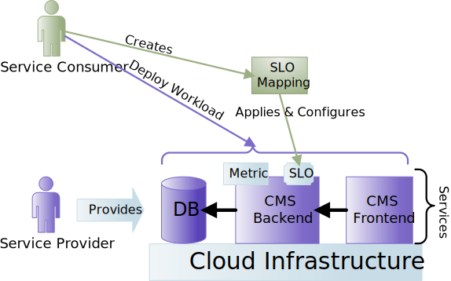

# Polaris SLO Cloud

The Polaris SLO Cloud project (previously called SLOC) aims to provide Service Level Objectives (SLOs) for next generation Cloud computing.

Service Level Agreements (SLAs) are very common in cloud computing.
Each SLA consists of one or more Service Level Objectives, which are measurable capacity guarantees.
Most SLOs in today's cloud environments are very low-level (e.g., average CPU or memory usage, throughput).

Elasticity is a fundamental property of cloud computing.
It is commonly understood as provisioning more resources for an application as the load grows and deprovisioning resources as the demand drops.
However, this *resource elasticity* is only one of three possible [elasticity dimensions](https://ieeexplore.ieee.org/document/6015579).
The other two are *cost elasticity* (i.e., how much is a customer willing to pay for a service) and *quality elasticity* (e.g., the desired accuracy of the prediction of a machine learning model).

The goal of the Polaris project is to bring **high-level SLOs** to the cloud and enable customers to leverage all three levels of elasticity.

For more details and background on the overall goals of the Polaris project, please see [this publication](https://ieeexplore.ieee.org/document/9146966).

## Motivating Example

Suppose a *service provider* (i.e., a cloud provider) wants to offer a Content Management System as-a-Service to its customers.
The CMS-as-a-Service that is being offered consists of the following services: a database, a headless backend (REST API only), and a frontend user interface.
Each service may expose one or more metrics, which can be simple ones like CPU usage or complex ones.
These metrics can be used by the service provider to set up SLOs.

*Service consumers*, i.e., Customers, who deploy the CMS-as-a-Service are not really interested in having an average CPU utiliztion of 80%, but instead want to have a "good performance for an acceptable cost".
Ideally they would like to specify a simple configuration that guarantees them a good performance without making their eyes pop out when they see the bill at the end of the month.

To this end, a [cost efficiency](http://www2.tisip.no/quis/public_files/wp7-cost-effectiveness-efficiency.pdf) SLO could be offered by the provider.
Based on [this article](https://ieeexplore.ieee.org/document/6319167), we define the cost efficiency of a cloud application as the number of requests per second faster than N milliseconds divided by the total cost of the service.
The cost efficiency could be exported by one or more services of the deployment as a *custom metric* and the service provider can use it as a base for creating an SLO that can be configured by the service consumers.
Polaris can then take care of automatically of scaling all services within the CMS-as-a-Service workload, based on this cost efficiency SLO.

A service consumer can now deploy the CMS-as-a-Service as a workload in his/her cloud subscription.
To configure the SLO, the consumer configures an *SLO Mapping*, which associates the cost efficiency SLO to the particular workload and supplies the desired cost efficiency as configuration values.

## Beyond Simple Scaling

Polaris does not only allow the development and configuration of complex SLOs, it also allows service consumers the choose the exact elasticity strategy they want to use when their SLO is violated.
The most common form (see [here](https://dl.acm.org/doi/10.1145/3148149)) of scaling in today's clouds is horizontal scaling, i.e., adding additional instances of a service (*scaling out*) or removing unneeded instances of the service (*scaling in*).

The service provider can offer multiple *elasticity strategies*, e.g., 
* Horizontal scaling (adding and removing instances)
* Vertical scaling (adding and removing resources, e.g., CPU and memory, to/from a single instance)
* A combination of horizontal and vertical scaling
* An elasticity strategy specifically tailored for a certain application

SLO Mappings allow service consumers to choose which elasticity strategy they want to use with their SLO, as long as their input/output data types match.

## Features

The Polaris project offers/will offer (the project is still under development) the following features:

* SLO Script, a language and framework for 
    * developing complex SLOs, based on one or more metrics
    * configuring these SLOs using SLO Mappings
    * developing composed metrics by aggregating other metrics
    * using predictions in metrics and SLOs to employ proactive scaling
    * developing custom elasticity strategies
* Generic elasticity strategies that can be used with multiple SLOs
* Generic SLOs that can be used with multiple elasticity strategies
* AI-based prediction models for metrics (see [polaris-ai](https://github.com/polaris-slo-cloud/polaris-ai)), usable as a composed metrics library

SLO Script consists of an orchestrator-independent core library and connector libraries for specific orchestrators.
Currently, there is a connector for Kubernetes.

## Repository Organization

This is a polyglot monorepository.
All code for this project is contained in this repository.

| Directory                | Contents |
|--------------------------|----------|
| [`docs`](./docs)         | Documentation files (Work in progress) |
| [`go`](./go)             | Go code, i.e., Kubernetes-specific controllers, etc. |
| [`testbeds`](./testbeds) | Configurations and demo applications, we use for testing |
| [`ts`](./ts)             | TypeScript code, i.e., all SLO Script libraries, SLO controllers, etc. |

## Documentation and Demos

Documentation for the Polaris project can be found in the [docs](./docs) folder.

This [video](https://www.youtube.com/watch?v=qRw_oyn_7Ss) provides an introduction to SLO script and shows an end-to-end demo (note that in the video the old project name, SLOC, is used).

The following videos showcase the capabilities of the Polaris CLI:

* [Quick walkthrough](https://www.youtube.com/watch?v=JVZ4hB2AmGs)
* [Step-by-step SLO Mapping Type and SLO Controller generation](https://www.youtube.com/watch?v=3_z2koGTExw)
* [Step-by-step Elasticity Strategy Type and Elasticity Strategy Controller generation](https://www.youtube.com/watch?v=U_Scw_oA0zw)

Additional demos can be found in [this repository](https://github.com/polaris-slo-cloud/polaris-demos).

## Our Users

The Polaris SLO Cloud project is actively used by the [orchestration layer](https://gitlab.com/rainbow-project1/rainbow-orchestration) of the [RAINBOW](https://rainbow-h2020.eu) project to bring complex SLOs to Fog Computing.
